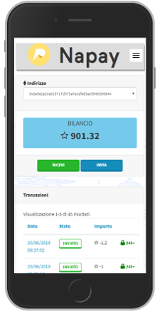

# fidelize store-wallet 
This is a fork of Napay TTS Store Wallet

❤️❤️❤️ A wallet using Naples Payment Token, implementing a lot of PWA love. ❤️❤️❤️

## Authors
Made with ❤️ by [Sergio Casizzone](https://sergiocasizzone.altervista.org)

## Features

**Wallet**

- [x] Mobile Layout
- [x] `Token` Balance
- [x] Token send & receive
- [x] Available in many languages
- [x] Transactions list
- [x] Transaction details
- [x] Blockchain sync & rescan

**PWA**

- [x] Service Worker
- [x] Push messages
- [x] Intensive use of indexedDB
- [x] Static precache & dynamic cache
- [x] Save coin send requests for offline use^

  (^) when the app returns on-line, memorized requests will be executed!   

**Security**

- [x] PIN protected access
- [x] Google 2FA Login
- [x] Seed management with recovery wallet
- [x] BIP32 passphrase

## Security

If you discover or learn about a potential error, weakness, or threat that can compromise the security of Wallet, we ask you to keep it confidential and [submit your concern directly to the Wallet TTS security team](mailto:info@txlab.it?subject=[GitHub]%20Store-Wallet%20Security).
